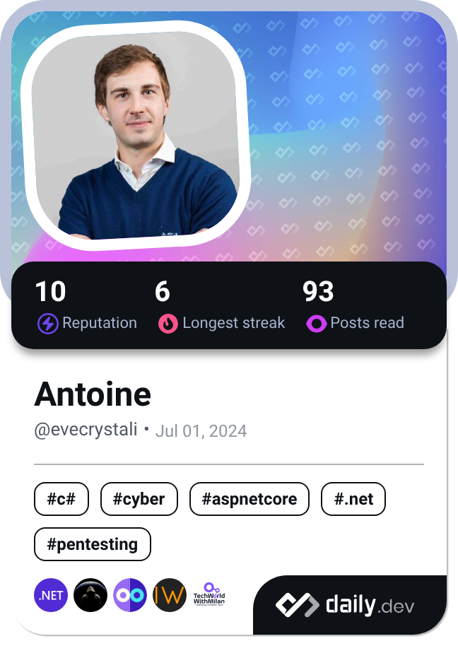

## Général : 
- **Développeur d'application back-end .NET**
- **Ingénieur ESTP** et titulaire d'un **MBA à l'IAE Panthéon Sorbonne**  
- Passionné de nouvelles technologies, jeux vidéo, et musique métal 🎸

---

## 📚 Formations & Certifications :
- **Développeur .NET (OpenClassrooms)**
– **Master Administration des Entreprises, IAE Panthéon Sorbonne**
- **Ingénieur ESTP**
- Classe Préparatoire aux Grandes Ecoles, Mathématique Physique
  
- 🏅 **Certifications :**
  - C, C++ et C# (SoloLearn)
  - HTML5/CSS3 (OpenClassrooms)
  - Angular (SoloLearn)

---

## 🛠️ **Langages et Frameworks :**

### 🔹 **Frontend** :

### 🔹 **Backend** :

### 🔹 **Bases de Données** :

---

## 🧰 **Outils & Technologies :**

---

## ✨ **Loisirs et Intérêts :**
🎮 **Jeux-vidéo, Montage de PC**  
🎸 **Batterie et Musique métal**  
🏞️ **VTT, Course, Ski**  
🌍 **Voyages :** États-Unis, Tanzanie, Islande...

---

